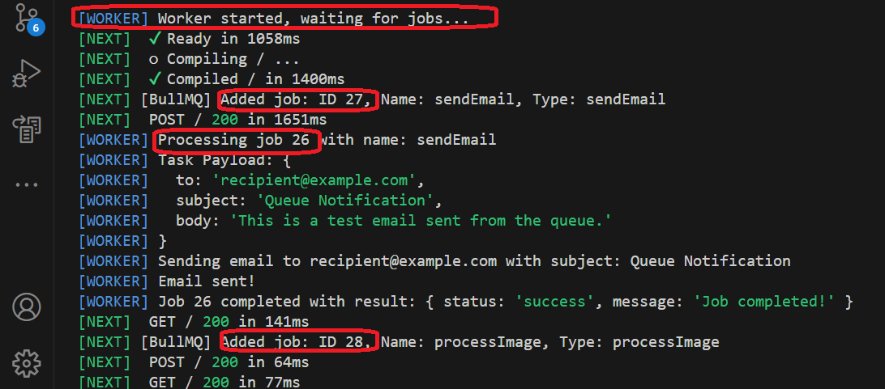

<h1>Project Name</h1>
....


<h2>Project Description</h2>
....

<h2>Motivation</h2>
....

<h2>Installation</h2>
packages - npm run dev

<h3>redis on wsl</h3>

<p>This is by far the <strong>best and most recommended way</strong> to run Redis (and many other Linux-based tools) on Windows for development. WSL 2 provides a full Linux kernel and environment, offering excellent performance and compatibility.</p>

<h3>How to do it:</h3>
<ol>
    <li>
        <strong>Enable WSL 2:</strong> Follow Microsoft's official guide to install WSL 2 and a Linux distribution (e.g., Ubuntu) from the Microsoft Store.
        <p>A good starting point for the official guide is: <a href="https://learn.microsoft.com/en-us/windows/wsl/install" target="_blank">Install WSL</a></p>
    </li>
    <li>
        <strong>Install Redis in WSL:</strong> Once your WSL 2 distro is set up, open its terminal and install Redis just as you would on a native Linux machine:
<pre><code>sudo apt update
sudo apt install redis-server
</code></pre>
    </li>
    <li>
        <strong>Start Redis:</strong>
<pre><code>sudo systemctl enable redis-server # Enable on boot (optional)
sudo systemctl start redis-server
</code></pre>
    </li>
    <li>
        <strong>Connect from Windows:</strong> Your Node.js (Next.js and Worker) apps running natively on Windows can connect to Redis running in WSL 2. The Redis server will be accessible at <code>localhost</code> or <code>127.0.0.1</code> from your Windows applications.
    </li>
</ol>

<div>
    <h4>Pros:</h4>
    <ul>
        <li><strong>Official Redis:</strong> You're running the official Linux build of Redis, ensuring full compatibility and performance.</li>
        <li><strong>Performance:</strong> WSL 2 offers near-native Linux performance.</li>
        <li><strong>Development Parity:</strong> Closer to a production Linux environment.</li>
        <li><strong>Easy Setup:</strong> Relatively straightforward with modern Windows.</li>
    </ul>
</div>

<div>
    <h4>Cons:</h4>
    <ul>
        <li>Requires Windows 10 version 1903 or higher, with the "Virtual Machine Platform" optional component enabled.</li>
    </ul>
</div>

<h4>Test redis status</h4>
The following is the most direct and recommended method.
This command attempts to connect to the Redis server and sends a PING command. It's the most reliable way to know if Redis is actually listening and responding.

```bash
 redis-cli ping
```
If Redis is running: You'll see PONG
If Redis is not running or unreachable: You'll see an error like Could not connect to Redis at 127.0.0.1:6379: Connection refused or similar.

Checking Service Status (Ubuntu 16.04+ using systemd):
Modern Ubuntu versions (16.04 and later, which WSL often uses) use systemd for managing services. This command gives you detailed information about the redis-server service.

```bash
sudo systemctl status redis
```

Interpreting `sudo systemctl status redis-server` Output:

<ul>
    <li>
        <strong>If Redis is running:</strong>
        Look for <code>Active: active (running)</code> in the output. You'll also typically see the process ID (PID), memory usage, and other details.
    </li>
    <li>
        <strong>If Redis is not running:</strong>
        You'll likely see <code>Active: inactive (dead)</code> or <code>Active: failed</code>.
    </li>
    <li>
        <strong>If you get an error like:</strong>
        <code>System has not been booted with systemd as init system (PID 1). Can't operate.</code>
        This indicates that your WSL instance is not running a full `systemd` init. In this scenario, you should typically use the older `sudo service redis-server status` command instead.
    </li>
</ul>

The result i got is shown here


<h4>important note about redis on wsl</h4>
if you close your WSL terminal, the Redis server running inside that WSL distribution will stop unless you've configured it to run as a background service that persists beyond terminal closure.

<h4>env variables</h4>
The IP address or hostname of your Redis server. For local development, this is often 127.0.0.1 (localhost).

```bash
REDIS_HOST=127.0.0.1
```

The port number your Redis server is listening on. The default Redis port is 6379.
REDIS_PORT=6379       

This variable is needed ONLY if your Redis server requires a password for authentication.
For a default, minimal local Redis setup, there's usually no password, so you can omit this line entirely.
If your local Redis *does* have a password, you must set it here.

```bash
REDIS_PASSWORD      
```

Set to 'false' if your Redis connection does NOT use SSL/TLS encryption.
Standard local Redis installations typically do not have TLS enabled.

```bash
REDIS_TLS_ENABLED=false 
```

<h2>Usage</h2>
use the scripts in the repo root

<h3>Bullmq important operations</h3>

<h4>Start the Redis server</h4>
<p>Ensure your Redis instance is running and accessible.</p>

<h4>Start worker</h4>
<p>Launch your worker process(es) that will consume tasks from the queue.</p>

<h4>Add task to queue</h4>
<p>Enqueue new tasks from your application for workers to process.</p>

<h4>Task mark complete (success / failure)</h4>
<p>Tasks are automatically marked as completed (successfully or with failure) by the queue system after processing.</p>
<p>BullMQ workers determine job completion based on the outcome of the job's processing function:</p>
<ul>
    <li><strong>Success:</strong> If the worker's processing function returns a value or a resolved promise without throwing any errors.</li>
    <li><strong>Failure:</strong> If the worker's processing function throws an unhandled error or returns a rejected promise.</li>
</ul>
<p>Once the outcome is determined, BullMQ updates the job's status in Redis (to <code>completed</code> or <code>failed</code>) and emits corresponding events for your application to react to.</p>


<h4>Get queue info</h4>
<p>Monitor the state of your queue, including pending, active, and failed tasks, to ensure smooth operation.</p>


<h2>Technologies Used</h2>
bullmq (redis)
next.js
node.js


<h2>Architecture</h2>
Three components
- web server (next.js app) , this is the queue task producer
- worker process (node.js app) , this is the queue task consumer
- message queue (bullmq)

<h2>design</h2>

<h3>how to poll for complate</h3>
- useEffect + interval
- react query
- other

<h3>how to get complete and progress</h3>


<h3>show info on queue - task now (api \ dashboard)</h3>

<h3>how to configure bullmq to allow only one task executing</h3>


<h2>Code Structure</h2>
....

<h2>Demo</h2>
....


<h2>open issues</h2>
<ul>
    <li>...</li>
</ul>

<h2>Points of Interest</h2>
<ul>
    <li>currently some common code is duplicated in next.js-app and worker projects : FFMPEG_QUEUE , QueueJobType and also the connection info. I have tried to use common folder so each project will import from. This was working ok using worker via but not using next.js . seems that putting the shared code in a package and import it will solve this but it seem too complicated for this repo. This is probably the right solution for production repo</li>
    <li>when you get error : connect ECONNREFUSED 127.0.0.1:6379 its because the redis server is not running. doing sudo systemctl status redis fix it</li>
   <li>many task appears as completd but i do not see them reaching the worker - no console.log  : it seems that bullmq is spawning more worker on top of the first because altough all tasks a remarked as completed or failed not all of them appear in the console as shown in this image (job id 27,28 are added to the queue but the first worker does not process them. he does process job id 26)

   
   
   You can investigate this by using winston logger by the workers and possibly write also the worker id
   </li>
   <li>using npm start i am able to add task and process by worker but it is not updated in jobs status i.e. not completed \ failed even when i refresh the page ===> the problem was the QueueStatus component which is server component thus render once even if the page is re-render. to fix this i added export const dynamic = 'force-dynamic';
in the hosting page. This directive tell not to use output server component cache and re-render it thus frwsh info is used</li>
</ul>

<h2>References</h2>
<ul>
    <li>...</li>
   
</ul>

