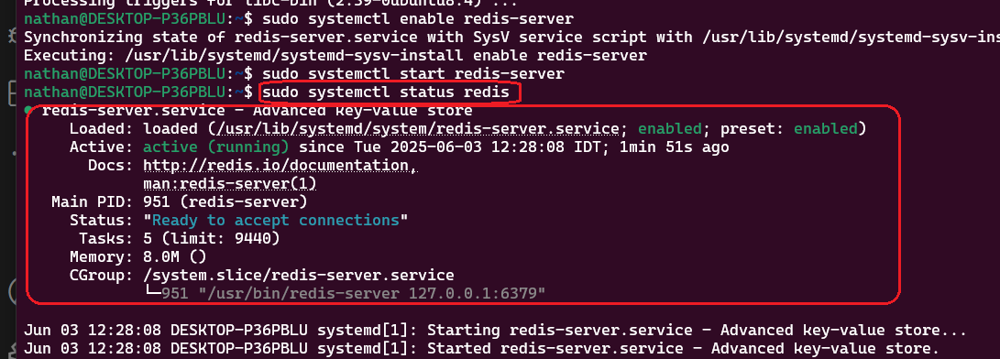

<h1>Project Name</h1>
....


<h2>Project Description</h2>
....

<h2>Motivation</h2>
....

<h2>Installation</h2>
packages - npm run dev

<h3>redis on wsl</h3>

<p>This is by far the <strong>best and most recommended way</strong> to run Redis (and many other Linux-based tools) on Windows for development. WSL 2 provides a full Linux kernel and environment, offering excellent performance and compatibility.</p>

<h3>How to do it:</h3>
<ol>
    <li>
        <strong>Enable WSL 2:</strong> Follow Microsoft's official guide to install WSL 2 and a Linux distribution (e.g., Ubuntu) from the Microsoft Store.
        <p>A good starting point for the official guide is: <a href="https://learn.microsoft.com/en-us/windows/wsl/install" target="_blank">Install WSL</a></p>
    </li>
    <li>
        <strong>Install Redis in WSL:</strong> Once your WSL 2 distro is set up, open its terminal and install Redis just as you would on a native Linux machine:
<pre><code>sudo apt update
sudo apt install redis-server
</code></pre>
    </li>
    <li>
        <strong>Start Redis:</strong>
<pre><code>sudo systemctl enable redis-server # Enable on boot (optional)
sudo systemctl start redis-server
</code></pre>
    </li>
    <li>
        <strong>Connect from Windows:</strong> Your Node.js (Next.js and Worker) apps running natively on Windows can connect to Redis running in WSL 2. The Redis server will be accessible at <code>localhost</code> or <code>127.0.0.1</code> from your Windows applications.
    </li>
</ol>

<div>
    <h4>Pros:</h4>
    <ul>
        <li><strong>Official Redis:</strong> You're running the official Linux build of Redis, ensuring full compatibility and performance.</li>
        <li><strong>Performance:</strong> WSL 2 offers near-native Linux performance.</li>
        <li><strong>Development Parity:</strong> Closer to a production Linux environment.</li>
        <li><strong>Easy Setup:</strong> Relatively straightforward with modern Windows.</li>
    </ul>
</div>

<div>
    <h4>Cons:</h4>
    <ul>
        <li>Requires Windows 10 version 1903 or higher, with the "Virtual Machine Platform" optional component enabled.</li>
    </ul>
</div>

<h4>Test redis status</h4>

```bash
sudo systemctl status redis
```

The result is shown here


<h4>important note about redis on wsl</h4>
if you close your WSL terminal, the Redis server running inside that WSL distribution will stop unless you've configured it to run as a background service that persists beyond terminal closure.

<h4>env variables</h4>
The IP address or hostname of your Redis server. For local development, this is often 127.0.0.1 (localhost).

```bash
REDIS_HOST=127.0.0.1
```

The port number your Redis server is listening on. The default Redis port is 6379.
REDIS_PORT=6379       

This variable is needed ONLY if your Redis server requires a password for authentication.
For a default, minimal local Redis setup, there's usually no password, so you can omit this line entirely.
If your local Redis *does* have a password, you must set it here.

```bash
REDIS_PASSWORD      
```

Set to 'false' if your Redis connection does NOT use SSL/TLS encryption.
Standard local Redis installations typically do not have TLS enabled.

```bash
REDIS_TLS_ENABLED=false 
```

<h2>Usage</h2>
....


<h2>Technologies Used</h2>
bullmq (redis)
next.js
node.js


<h2>Architecture</h2>
Three components
- web server (next.js app) , this is the queue task producer
- worker process (node.js app) , this is the queue task consumer
- message queue (bullmq)

<h2>design</h2>

<h3>how to poll for complate</h3>
- useEffect + interval
- react query
- other

<h3>how to get complete and progress</h3>


<h3>show info on queue - task now (api \ dashboard)</h3>

<h3>how to configure bullmq to allow only one task executing</h3>


<h2>Code Structure</h2>
....

<h2>Demo</h2>
....

<h2>sharing common between worker and next.js-app</h2>
altough i have used before rootsDir it seems that baseUrl and paths is better :

This approach explicitly defines how to resolve imports from the common directory for each project. It's clean, effective for sharing types and utility functions, and avoids the "virtual merged root" semantics of rootDirs which are often overkill for simple code sharing.
==========================> i got problems with it so i am using my
<a href='https://www.youtube.com/watch?v=BhWFy7orx-M'>video</a> which suggest using rootDirs but seems it is working without so i have remark it

<h2>open issues</h2>
<ul>
    <li>i get build error :connect ECONNREFUSED 127.0.0.1:6379
    at <unknown> (Error: connect ECONNREFUSED 127.0.0.1:6379) {
  errno: -4078,
  code: 'ECONNREFUSED',
  syscall: 'connect',
  address: '127.0.0.1',
  port: 6379
}</li>
<li>compile is clean but num run dev - i get error when i access the page : Build Error
Module not found: Can't resolve '../../../common/src/logic/constants'
./src/logic/queue-utils.ts (3:1). but no problem for npm start</li>
   
</ul>


<h2>Points of Interest</h2>
<ul>
    <li>currently some common code is duplicated in next.js-app and worker projects : FFMPEG_QUEUE , QueueJobType and also the connection info. I have tried to use common folder so each project will import from. This was working ok using worker via but not using next.js . seems that putting the shared code in a package and import it will solve this but it seem too complicated for this repo. This is probably the right solution for production repo</li>
   
</ul>

<h2>References</h2>
<ul>
    <li>...</li>
   
</ul>

