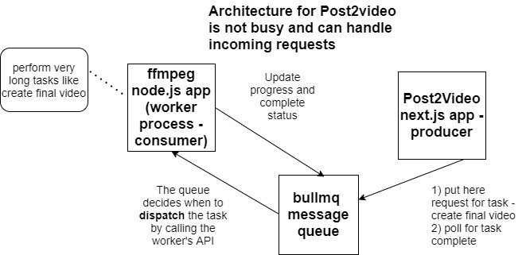

<h1>Project Name</h1>
Bullmq basics


<h2>Project Description</h2>
This project demonstrates how to offload long-running tasks like FFmpeg operations from a Next.js web server to a BullMQ message queue and a dedicated worker process to improve server responsiveness and scalability

<h2>My Motivation</h2>
You have your Next.js app deployed on a DigitalOcean droplet (4GB RAM, 2 cores). You have it perform FFmpeg operations on the server, which may last a few minutes. FFmpeg is CPU-intensive, so other clients trying to access the server might fail because the process is busy with FFmpeg.

To address this, we offload long-running tasks to a message queue (BullMQ) and process them in a separate worker. This prevents the main server from getting blocked.

BullMQ is a popular message queue library for Node.js applications.

This challenge came up in my new SaaS project, Post2Video — where we generate videos using FFmpeg from blog and readme content

<h2>Installation</h2>
Install dependency packages using:

```bash
 pnpm i
 ```

<h3>Redis on wsl</h3>

<p>This is by far the <strong>most recommended way</strong> to run Redis (and many other Linux-based tools) on Windows for development. WSL 2 provides a full Linux kernel and environment, offering excellent performance and compatibility.</p>

<h3>How to do it:</h3>
<ol>
    <li>
        <strong>Enable WSL 2:</strong> Follow Microsoft's official guide to install WSL 2 and a Linux distribution (e.g., Ubuntu) from the Microsoft Store.
        <p>A good starting point for the official guide is: <a href="https://learn.microsoft.com/en-us/windows/wsl/install" target="_blank">Install WSL</a></p>
    </li>
    <li>
        <strong>Install Redis in WSL:</strong> Once your WSL 2 distro is set up, open its terminal and install Redis just as you would on a native Linux machine:
<pre><code>sudo apt update
sudo apt install redis-server
</code></pre>
    </li>
    <li>
        <strong>Start Redis:</strong>
<pre><code>sudo systemctl enable redis-server # Enable on boot (optional)
sudo systemctl start redis-server
</code></pre>
    </li>
    <li>
        <strong>Connect from Windows:</strong> Your Node.js (Next.js and Worker) apps running natively on Windows can connect to Redis running in WSL 2. The Redis server will be accessible at <code>localhost</code> or <code>127.0.0.1</code> from your Windows applications.
    </li>
</ol>

<div>
    <h4>Pros:</h4>
    <ul>
        <li><strong>Official Redis:</strong> You're running the official Linux build of Redis, ensuring full compatibility and performance.</li>
        <li><strong>Performance:</strong> WSL 2 offers near-native Linux performance.</li>
        <li><strong>Development Parity:</strong> Closer to a production Linux environment.</li>
        <li><strong>Easy Setup:</strong> Relatively straightforward with modern Windows.</li>
    </ul>
</div>

<div>
    <h4>Cons:</h4>
    <ul>
        <li>Requires Windows 10 version 1903 or higher, with the "Virtual Machine Platform" optional component enabled.</li>
    </ul>
</div>

<h4>Test redis status</h4>
The following is the most direct and recommended method.
This command attempts to connect to the Redis server and sends a PING command. It's the most reliable way to know if Redis is actually listening and responding.

```bash
 redis-cli ping
```
If Redis is running: You'll see PONG
If Redis is not running or unreachable: You'll see an error like Could not connect to Redis at 127.0.0.1:6379: Connection refused or similar.

Checking Service Status (Ubuntu 16.04+ using systemd):
Modern Ubuntu versions (16.04 and later, which WSL often uses) use systemd for managing services. This command gives you detailed information about the redis-server service.

```bash
sudo systemctl status redis
```

Interpreting `sudo systemctl status redis-server` Output:

<ul>
    <li>
        <strong>If Redis is running:</strong>
        Look for <code>Active: active (running)</code> in the output. You'll also typically see the process ID (PID), memory usage, and other details.
    </li>
    <li>
        <strong>If Redis is not running:</strong>
        You'll likely see <code>Active: inactive (dead)</code> or <code>Active: failed</code>.
    </li>
    <li>
        <strong>If you get an error like:</strong>
        <code>System has not been booted with systemd as init system (PID 1). Can't operate.</code>
        This indicates that your WSL instance is not running a full `systemd` init. In this scenario, you should typically use the older `sudo service redis-server status` command instead.
    </li>
</ul>

The result i got is shown here


<h4>important note about redis on wsl</h4>
If you close your WSL terminal, the Redis server running inside that WSL distribution will stop unless you've configured it to run as a background service that persists beyond terminal closure.

<h4>env variables</h4>
The IP address or hostname of your Redis server. For local development, and often for production deployments where Redis, the web server, and worker processes run on the same machine, this is typically <code>127.0.0.1</code> (localhost).


```bash
REDIS_HOST=127.0.0.1
```

The port number your Redis server is listening on. The default Redis port is 6379.

```bash
REDIS_PORT=6379       
```

This variable is needed ONLY if your Redis server requires a password for authentication.
For a default, minimal local Redis setup, there's usually no password, so you can omit this line entirely.
If your local Redis *does* have a password, you must set it here.

```bash
REDIS_PASSWORD      
```

Set to 'false' if your Redis connection does NOT use SSL/TLS encryption.
Standard local Redis installations typically do not have TLS enabled.

```bash
REDIS_TLS_ENABLED=false 
```

<h2>Usage</h2>

<p>
  To streamline your <strong>development experience</strong>, you can run both the web server and worker processes concurrently using the <code>dev</code> script defined in the root <code>package.json</code>:
</p>

```bash
pnpm run dev
```

<hr>

<p>
  For <strong>production deployment</strong> or to run the application in a production-like environment, you'll typically build the Next.js application and then start it:
</p>

<h3>Build the Application</h3>
<p>
  This command compiles your Next.js application for production:
</p>

```bash
pnpm run build
```

<h3>Start the Application</h3>
<p>
  After building, this command will start the Next.js server and, if your <code>start</code> script is configured to also launch the worker (which is a good practice for production), it will also start the worker process:
</p>

```bash
pnpm start
```


<h3>Bullmq important operations</h3>
<p>This section outlines the essential operations required to manage and interact with your BullMQ-based queue system, from starting necessary services to handling tasks.</p>

<h4>Start the Redis server</h4>
<p>Ensure your Redis instance is running and accessible.</p>
Following the installation, you need the Linux environment to be running because the redis server is installed there


<h4>Start worker</h4>
<p>Launch your worker process(es) that will consume tasks from the queue.</p>

Simply invoke the index file under worker/src/logic

<h4>Add task to queue</h4>
<p>Enqueue new tasks from your application for workers to process.</p>

Call addTask function

```ts
 enum QueueJobType {
  SendEmail = "sendEmail",
  ProcessImage = "processImage",
  GenerateReport = "generateReport",
}

function addTask(
  jobName: QueueJobType,
  data: any,
  options?: JobsOptions // Use BullMQ's JobsOptions  type
): Promise<{ jobId: string; jobName: string }> 
```

<h4>Task mark complete (success / failure)</h4>
<p>Tasks are automatically marked as completed (successfully or with failure) by the queue system after processing.</p>
<p>BullMQ workers determine job completion based on the outcome of the job's processing function:</p>
<ul>
    <li><strong>Success:</strong> If the worker's processing function returns a value or a resolved promise without throwing any errors.</li>
    <li><strong>Failure:</strong> If the worker's processing function throws an unhandled error or returns a rejected promise.</li>
</ul>
<p>Once the outcome is determined, BullMQ updates the job's status in Redis (to <code>completed</code> or <code>failed</code>) and emits corresponding events for your application to react to.</p>

<h4>get Task status</h4>


Call getJobStatus

```ts
function getJobStatus(jobId: string): Promise<JobStatus> 
```

<h4>Get queue info</h4>
<p>Monitor the state of your queue, including pending, active, and failed tasks, to ensure smooth operation.</p>

Call getQueueInfo

```ts
function getQueueInfo(): Promise<QueueInfo> 
```


<h2>Technologies Used</h2>
<ul>
  <li>BullMQ (Redis)</li>
  <li>Next.js</li>
  <li>Node.js</li>
  <li>Concurrently</li>
  <li>Mui</li>
</ul>


<h2>Architecture</h2>
Three components
- web server (next.js app) , this is the queue task producer
- worker process (node.js app) , this is the queue task consumer
- message queue (bullmq)

The schema appears in this image



<h2>Design considerations</h2>
<p>When implementing a system that relies on background tasks, several design choices become crucial. This section explores key considerations, particularly around how to effectively track and manage the status of your tasks.</p>

<h3>How to poll for task status</h3>
<ul>
  <li><code>useEffect</code> + <code>setInterval</code></li>
  <li>React Query</li>
  <li>Web Socket</li>
</ul>


For most standard polling scenarios, especially when you have good control over the polling interval and termination,  React Query (TanStack Query) is highly recommended. It offers a fantastic developer experience, handles many common pitfalls, and provides powerful features for managing server state. It's an industry standard for a reason.


<h2>Code Structure</h2>

<p>This section provides a brief overview of key functions and how the BullMQ queue and related operations are set up within the project's codebase.</p>

<h3>Create myQueue</h3>

```ts

const connectionOptions = {
  host: process.env.REDIS_HOST,
  port: parseInt(process.env.REDIS_PORT, 10),
  password: process.env.REDIS_PASSWORD,
  tls: process.env.REDIS_TLS_ENABLED === "true" ? {} : undefined,
};

const queueName = FFMPEG_QUEUE;

const myQueue = new Queue(queueName, { connection: connectionOptions });

```

<h3>function addTask</h3>

```ts
export async function addTask(
  jobName: QueueJobType,
  data: any,
  options?: JobsOptions // Use BullMQ's JobsOptions  type
): Promise<{ jobId: string; jobName: string }> {
  const job = await myQueue.add(jobName, data, options);

  // BullMQ guarantees job.id and job.name are set after a successful add
  console.log(
    `[BullMQ] Added job: ID ${job.id}, Name: ${job.name}, Type: ${jobName}`
  );
  return { jobId: job.id!, jobName: job.name };
}
```

<h3>function getJobStatus</h3>

```ts
export async function getJobStatus(jobId: string): Promise<JobStatus> {
  if (!jobId) {
    throw new Error("Job ID is required");
  }

  const job = await myQueue.getJob(jobId);

  if (!job) {
    return { status: "not-found", jobId: jobId };
  }

  const state = await job.getState();
  const result = job.returnvalue;
  const failedReason = job.failedReason;

  return {
    jobId: job.id,
    status: state,
    result: result,
    failedReason: failedReason,
    progress: job.progress,
  };
}

```


<h3>function getQueueInfo</h3>

```ts
function getQueueInfo(): Promise<QueueInfo> {
  const waitingCount = await myQueue.getWaitingCount();
  const activeCount = await myQueue.getActiveCount();
  const delayedCount = await myQueue.getDelayedCount();
  const failedCount = await myQueue.getFailedCount();
  const completedCount = await myQueue.getCompletedCount();

  const totalQueueLength = waitingCount + activeCount + delayedCount;

  return {
    queueName: queueName,
    waiting: waitingCount,
    active: activeCount,
    delayed: delayedCount,
    failed: failedCount,
    completed: completedCount,
    totalQueueLength: totalQueueLength,
  };
}
```

<h2>Demo</h2>

<p>This section provides a visual walkthrough of the application's key functionalities, demonstrating how tasks are added to the queue and their status is tracked.</p>

The home page is shown in the following image


Clicking on the "Add Task" button will add a task to the queue; notice job ID 48


Given the created job ID 48, use it to track the job status


<h2>Points of Interest</h2>
<ul>
    <li>Currently some common code is duplicated in Next.js app and worker projects : FFMPEG_QUEUE , QueueJobType , and also the connection info (connection in worker and connectionOptions in next.js app). I have tried to use common folder so each project will import from it. This was working ok using worker using <a href='#ref2'>[2]</a> but not using next.js . It seems that putting the shared code in a package and import it will solve this but it seem too complicated for this repo. This is probably the right solution for production repo</li>
    <li>When you get the error : 'connect ECONNREFUSED 127.0.0.1:6379' its because the Redis server is not running. doing sudo systemctl status redis fix it</li>
   <li>Many tasks appears as completed but I do not see them reaching the worker (no console.log) it seems that BullMQ is spawning more workers on top of the first because although all tasks are marked as completed or failed not all of them appear in the console as shown in this image (job  IDs 27,28 are added to the queue but the first worker does not process them. it does process job id 26)


   You can investigate this by using a Winston logger in the worker and possibly write also the worker ID
   </li>
   <li>Using <code>npm start</code> I am able to add tasks and process them by the worker but it is not updated in jobs status (i.e., not 'completed' or 'failed')  even when I refresh the page. The problem was that the QueueStatus component, being a server component, renders only once even if the page is re-rendered. To fix this i added <code>export const dynamic = 'force-dynamic'</code>
   to the hosting page. This directive tells Next.js not to use output server component caching and to re-render it, thus fresh info is used.</li>
</ul>

<h2>References</h2>
<ul>
    <li id='ref1'><a href='https://bullmq.io/'>BullMQ home page</a></li>
   <li id='ref2'><a href='https://www.youtube.com/watch?v=BhWFy7orx-M'> Share code between react client and express server </a></li>
</ul>

